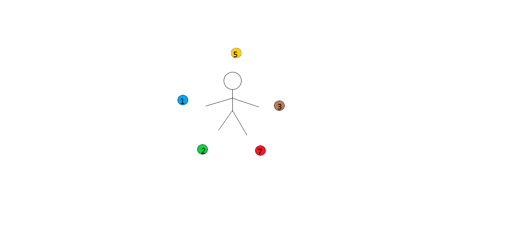

# 元素法印示意图





注：元素击碎后的元素法印应当呈现破碎效果，被击碎的元素法印上也标有数字，表示几回合后该法印会复原。

# 需要UI的效果

# 元素联动

```

金+土：【免疫】：免疫下一次伤害（持续到下次伤害到来）

火+木：【引燃】：令敌方获得5层燃烧，每次攻击消耗一层燃烧对敌人造成敌人2%当前生命值额外物理伤害（额外伤害小于1时改为1，属性与触发燃烧效果的攻击相同）（永久）

火+木+土：【自燃】：下次受到的伤害时敌人受到等量伤害（持续到下次伤害到来）

金+土+水：【洞察】：无效敌方下一次的伤害和控制效果（分两部分，分别持续到下次伤害到来和下次控制到来，UI可画成两个，免疫伤害用【免疫】图标。免疫控制再画一个）

火+土+金：【淬炼】：为敌方施加5层淬炼效果，每回合开始时消耗一层淬炼对敌方造成（1%*淬炼层数）最大生命值物理伤害。（永久）
```

## 元素击碎

```
金：【枯竭】：令对方造成的物理伤害降低20%（具体数值可能受卡牌效果影响）

水：【破魔】：令对方受到的魔法伤害增加20%（具体数值可能受卡牌效果影响）

火：【破甲】：令对方受到的物理伤害增加20%（具体数值可能受卡牌效果影响）

土：【弱化】：令对方造成的魔法伤害降低20%（具体数值可能受卡牌效果影响）
```

## 卡牌效果

```
【护甲】：固有属性，每回合开始时，若护盾值小于护甲值，将物理护盾值恢复到护甲值（护甲值若不被削减永久拥有）

【清算】：回合结束时对敌人造成等量清算值的水属性魔法伤害，并将清算值清零

【疗养】：OnBeforeTurnStart:回复50点生命和5点法力，削减一层自身。

【厄运】：三回合后生效造成100点土属性魔法伤害（生效于敌方回合开始时）

【铁甲加固】：本场战斗中，每增加一次护盾，对敌人造成30%本次护盾值的金属性物理伤害
```


