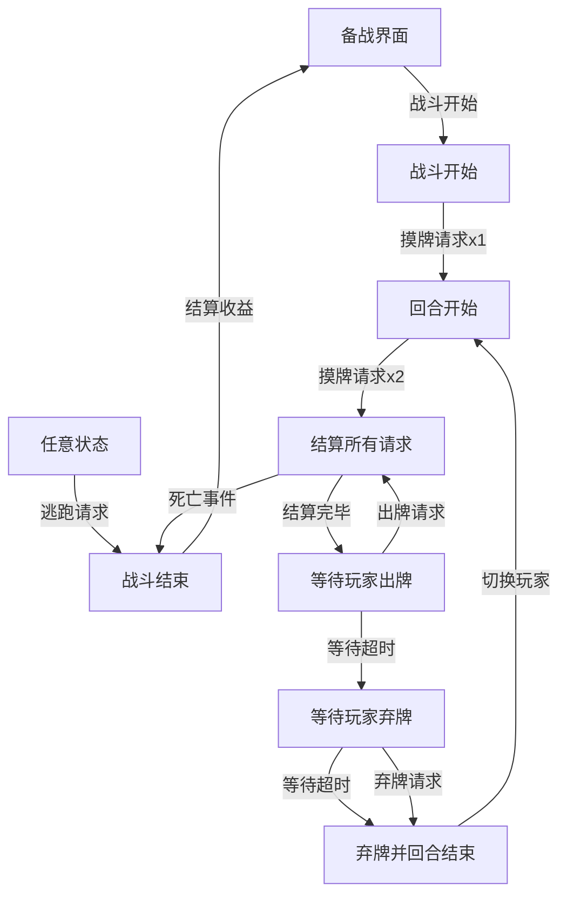
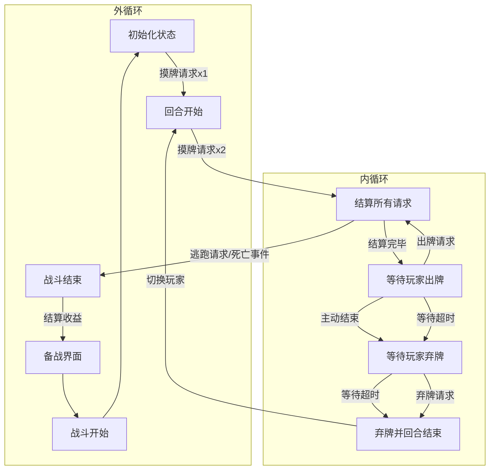

# 战斗模块

## 战斗属性

- 生命值
- 最大生命值
- 法力值
- 最大法力值

## 战斗流程图





// Todo 添加判断状态

## 请求系统

```csharp
class GameRequest {
    // 用于拦截请求
    public bool Reject;

    // 修改逻辑状态前的动画
    public virtual void PlayPreAnimation();
    // 修改逻辑状态的代码
    public virtual void ExecuteLogic();
    // 修改逻辑状态后的动画
    public virtual void PlayPostAnimation();
}
```

## 战斗时间节点

- 战斗开始