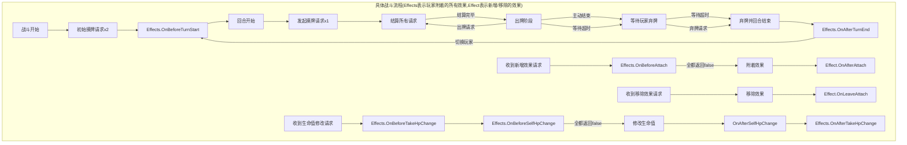
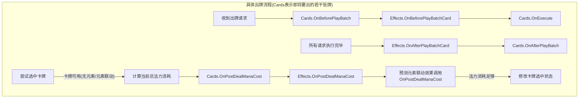

```mermaid
graph RL
subgraph 战斗外流程
    A[菜单界面] --> B[选择敌人]
    B --> C[选择出战卡牌]
    C --> D[初始化战斗信息]
    D --> E[等待具体战斗结果]
    E --> |逃跑| F[结算逃跑收益]
    E --> |重试| D
    E --> |胜利| G[结算胜利收益]
    E --> |失败| H[结算失败收益]
    F & G & H --> A
end
```





