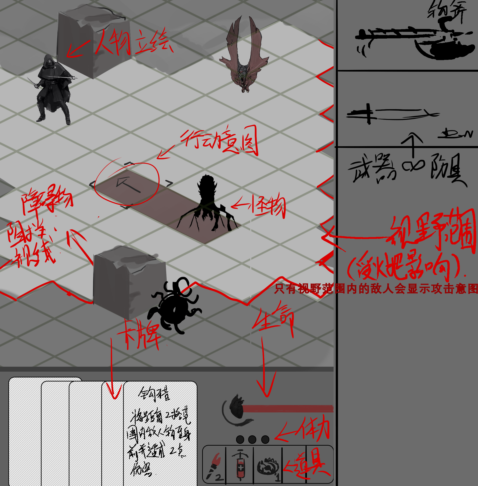

# 游戏示意图



# 游戏世界观

见`world.md`

# 游戏主流程

Todo 策划完善

# 战斗系统

Todo 策划完善扩展

## 可战斗实体

属性

- 生命值
- 法力值
- 等级

- 经验

- 状态tag , 如
    - 沉默
    - ...
-
- 元素附着(的剩余元素量) , 如
    - 金
    - 木...
-
- 出牌次数
- 手牌上限
- 当前手牌
- 剩余牌堆

行为

- 摸牌
- 出牌
- 弃牌
- 回合结束

## 卡牌

属性

- 法力消耗
- 元素附着
- 伤害类型
- 基础伤害
- 附加buff

## Effect

技能 , 道具 , 卡牌 , Buff ... 等等都只是对状态的修改 , 区别只在于

- who

  可战斗实体 , 包括

    - 玩家
    - 怪物

  两者区别只在于控制器不同

  甚至还包括 :

    - 伤害
    - 其他effect

- when

    - 回合开始前
    - 回合结束后
    - 效果附着前
    - 效果消失后
    - 造成伤害前
    - 计算伤害前
    - 计算伤害后
    - 造成伤害后
    - ... 其他可扩展的事件

- what

  加减(不能乘)可战斗实体的独立属性 , 如 :

    - 基础最大生命值
    - 最大生命值加成

    - 当前生命值
    - 当前法力值

  但不包括 :

    - 最大生命值(=基础最大生命值*(1+最大生命值加成))

  因为直接修改复合字段(一般用了乘法) , 可能会导致临时性effect改变原始属性 , 例如:

  ```
  生命值:100
  effect1生效:+10%生命值 => 110
  effect1消失:-10%生命值 => 99 != 100
  ```

  故复合字段不能直接由effect修改 , 而是需要通过作用到它依赖的独立属性上间接修改 ,

  因为只对独立属性加减能保证临时性effect消失后不改变原始状态都是一致的 .

- config

    - 结算优先级 : 优先级越高 , 越先结算
    - 是否可叠加同一效果

- ui

  可视化附着效果

    - 效果图标
    - 叠加层数
    - 持续回合数

## Effect示例

### 瞬时性类

属性修改 :

- who : 附着对象
- when : 效果附着后
- what : 对某个字段加上某个值 , 立刻移除自身
- config : 字段类型,字段名

伤害请求 :

- who : 附着对象
- when : 效果附着后
- what : 触发"计算伤害前"事件,计算伤害,触发"计算伤害后"事件,附加属性修改效果,立刻移除自身
- config : 伤害类型,伤害值,创建者

### 临时性类

属性修改 :

- who : 附着对象
- when : 效果附着后
- what : 对某个字段加上某个值
- when : 效果消失后
- what : 减去之前加的值
- config : 字段类型,字段名

### 持续性类

中毒 :

- who : 附着对象
- when : 回合结束后
- what : 扣除xxx点当前生命值
- config : 生效回合数,伤害值

### 被动技能类

淬毒武器 :

- who : 附着对象造成伤害的对象
- when : 造成伤害时
- what : 立刻施加中毒效果

元素附魔武器 :

- who : 附着对象造成的伤害
- when : 计算伤害前
- what : 为伤害附加xxx点元素附着量
- config : 附带元素量,附带元素类型

元素弥留 :

- who : 附着对象受到的伤害
- when : 受到伤害后 , 死亡前
- what : 若伤害致死且剩余元素附着 , 则添加免疫死亡tag

元素击碎(木) :

- who : 附着对象造成伤害的对象
- when : 造成伤害后
- what : 二次施加造成xxx%当前生命值的伤害
- config : 伤害百分比

元素联动(金+木) :

- who : 附着对象
- when : 玩家出牌后且只有元素金木
- what : 添加伤害免疫次数x1

元素联动(木+火) :

- who : 附着对象造成伤害的对象
- when : 玩家出牌造成伤害后且只有元素木火
- what : 施加灼烧效果

护甲 :

- who : 附着对象
- when : 受到伤害前
- what : 减少伤害值

反甲 :

- who : 附着对象
- when : 受到伤害后
- what : 为来源施加反弹伤害

### 主动技能类

回合开始

- who : 附着对象
- when : 系统自动触发
- what : 触发"回合开始"事件

出牌

- who : 附着对象
- when : 主动触发后
- what : 触发"出牌"事件

回合结束

- who : 附着对象
- when : 系统自动触发或超时操作
- what : 触发"回合结束"事件

## 战斗流程

Todo 策划完善

- 战斗对象 : PVP / PVE
- 战斗开始前 : 决定先后手(如随机选取)
- 回合开始前 : 双方摸牌
- 先手回合开始
- 先手出牌
- 先手回合结束
- 后手回合开始
- 后手出牌
- 后手回合结束