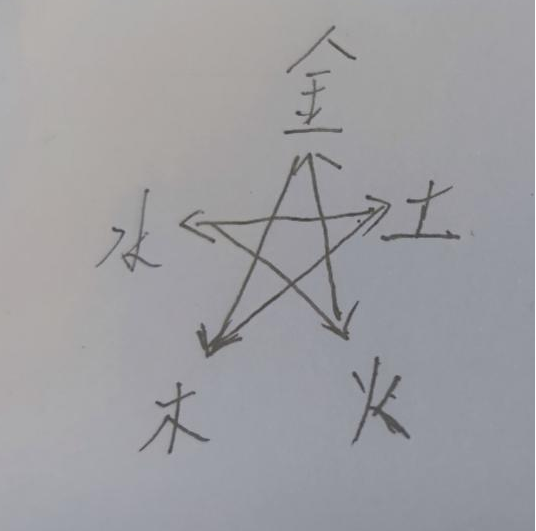

元素系统：

1.克制关系，金->木->土->水->火->金，五芒星相互克制（金->木表示金克制木）
卡组主要由这五类元素卡牌构成。

2.元素击碎，不同怪物身边标记有不同的元素法印，元素法印上会标有数字，
使用克制该法印的元素对其进行一次攻击可减少数字，数字减为0造成元素击碎，
不同元素的击碎会为敌人施加不同的负面效果，有的破甲，有的减攻击力等等
法印被击碎后，数字代表几回合后元素击碎失效怪物将重新获得对应法印。
（待改进：元素击碎的方式究竟与伤害值相关还是与伤害次数相关，
还是根据不同的流派为不同的元素设置元素击碎方式，
若按次数，则鼓励元素联动过牌，但由于【清算】机制的存在，水元素卡牌的优先级会下降
若按伤害，则鼓励元素叠加打爆发。
目前先按次数设计， 这样可以使用克制元素搭配其相邻元素触发元素联动过牌，
击碎被克制元素的元素法印后，使用被克制元素元素叠加爆发， 后续可进行讨论）

3.元素变换，较为强悍的敌人拥有元素变换效果，会在战斗过程中通过某种方式变换元素
（卡牌效果或是经过固定回合变换，若为后者，在法印上标记出经过多少回合会变换）

4.元素联动，一次性打出多张【不同元素且元素位置在五芒星中相临的牌】可触发元素联动效果，并抽一张牌，
元素五芒星如下图：



举例，水元素卡牌和木元素卡牌可一起打出，施加【宁静】效果；
火元素卡牌、土元素卡牌和金元素卡牌可一同打出，施加某种效果；
五种元素卡牌可以一同打出，施加【净化】效果
（*具体效果还没想好，但可以考虑把此作为核心玩法，与世界观结合起来，
将此组合作为直接击杀目标的必要条件之一，然后通过某种机制限制玩家从自身卡牌中获取特定元素的卡牌）
但是水元素卡牌和土元素卡牌无法同时打出，因为他们的位置在元素五芒星中【不相邻】。

5.元素弥留，若怪物生命值为0时，其依然拥有【未被击碎的元素法印】，
则该怪物陷入元素弥留状态，不会死亡（*将所有属性卡牌都替换为未被击碎的元素法印属性）
直至其所有法印被击碎为止。

6.元素叠加，一次打出多张相同元素的卡牌，
可根据所出牌数使卡牌的总效果提升5%/10%/15%/20%
（总效果包括恢复生命、回复法力、造成伤害、获得护盾、获得护甲、获得清算）。


角色
```
{
生命值
法力值
出牌次数（限制角色每回合的最大出牌次数，注意是次数不是张数）
元素法印标记（被击碎不同标记会遭受不同负面效果）
手牌上限（随等级提升的数值，多余卡牌回合结束时弃置）
经验
等级

摸牌（从牌库摸牌，每回合摸牌数量随等级提升，部分卡牌也可能触发摸牌效果）
出牌（目前想到的联动操作有：攻击触发对方标记；给自己上装备；保护自己的标记不被击碎）
回合结束
弃牌（玩家手中的手牌数量大于手牌上限时弃置）
}
```


卡牌
```
{
法力消耗
元素属性
类型（物理/魔法）
伤害值
效果（卡牌本身带的特殊效果，是个方法）
}
```

五种元素击碎带来的特效分别为：

（持续回合数和元素法印恢复所需回合数相同）

金：枯竭：令对方造成的物理伤害降低20%（具体数值可能受卡牌效果影响）

水：破魔：令对方受到的魔法伤害增加20%（具体数值可能受卡牌效果影响）

木：粉碎：对对方造成10%当前生命值击碎卡牌类型的伤害（具体数值可能受卡牌效果影响）

火：破甲：令对方受到的物理伤害增加20%（具体数值可能受卡牌效果影响）

土：弱化：令对方造成的魔法伤害降低20%（具体数值可能受卡牌效果影响）

不同卡牌效果制作思路：

金：无消耗的物理护甲叠加为主的卡牌，包含部分低伤害单次攻击牌，主修防御流，示例卡牌效果：对敌人造成5点金属性物理伤害，同时自身获得5点物理护甲（物理护甲用于抵挡等量物理伤害）

水：带消耗魔法伤害为主的卡牌，多为高伤害单次魔法伤害牌，同时可能附带某种效果（还没想好，不行就不带了）。例如：法力消耗5，对对方造成10点魔法伤害。

木：带消耗回复类型为主卡牌，几个思路：【汲取】消耗5点法力，对敌方造成5点魔法伤害，回复自身3点体力。【恢复】消耗2点法力，恢复5点体力；【清晰】恢复3点法力

火：无消耗物理伤害为主的卡牌，考虑加入连击效果，例如：对敌人造成5次1点伤害

土：带消耗的魔法护甲叠加卡牌，附带反伤效果，例如：消耗5点法力，为自身添加一个5点的魔法护盾用于抵挡等量魔法伤害，同时护盾存在时，每受到1次魔法伤害，对对方造成2点土属性魔法伤害（根据实现难度可改为护盾存在时每受到1点魔法伤害，对对方造成等量土属性魔法伤害）

功能牌：无属性

消耗法力/生命/无

功能牌不能搭配有属性牌打出，通常功能强大，用于增加游戏拓展性。例如，
```
渴望
{
法力消耗：4
效果：不计入出牌次数，抽两张牌，
}
死亡契约
{
法力消耗：全部
类型（物理/魔法）：魔法
效果：将自身生命值恢复至与自身已损失生命值相同，同时对敌人造成你回复生命值数量的魔法伤害，三回合后，你死亡。
}
火元素召唤
{
消耗：2
效果：从牌库中抽取一张火元素卡牌
}
```


元素联动：

金+土：免疫：免疫下一次伤害（持续到下次伤害到来）

火+土：固定：令自身魔法护盾值增加20%（永久）

水+金：滋润：令自身物理护盾值增加20%（永久）

火+木：引燃：令敌方获得5层燃烧，每次攻击消耗一层燃烧对敌人造成敌人2%当前生命值额外物理伤害（额外伤害小于1时改为1，属性与触发燃烧效果的攻击相同）（永久）

水+木：宁静：本次出牌法力消耗减半

火+木+土：自燃：下次受到的伤害时敌人受到等量对应属性对应类型的74伤害（持续到下次伤害到来）

金+土+水：洞察：无效敌方下一次的伤害和控制效果（分两部分，分别持续到下次伤害到来和下次控制到来）

金+水+木：不竭：本次出牌法力消耗减半，抽一张牌

火+土+金：淬炼：为敌方施加5层淬炼效果，每回合开始时消耗一层淬炼对敌方造成（1%*淬炼层数）最大生命值物理伤害。（永久）

水+火+木：击碎：令敌方物理和魔法护盾值各减少20%

金+木+水+火+土：净化：直接击碎全部敌方法印，斩杀生命值低于10%的敌人。

（注：自燃、免疫、洞察类效果不能重复叠加；淬炼、引燃可叠加）

